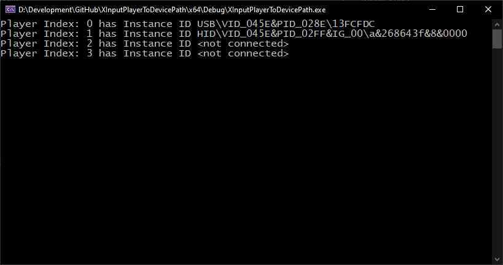

# XInput User Index to Device Instance ID PoC

Crude example project demoing how one can use API hooking [`CreateFile`](https://learn.microsoft.com/en-us/windows/win32/api/fileapi/nf-fileapi-createfilew) to reverse-lookup the device instance ID of the device behind a given user/player index.

Since the XInput API is deliberately kept simple and opaque, we need to get creative if we need the Player index to device association. The idea is as follows:

- We hook [`CreateFile`](https://learn.microsoft.com/en-us/windows/win32/api/fileapi/nf-fileapi-createfilew) since any XInput DLL internally enumerates and opens the desired instance of the device running under `XUSB22.sys`
  - This grants us easy access to the device path/symbolic link we will need later on
- Call [`XInputGetCapabilities`](https://learn.microsoft.com/en-us/windows/win32/api/xinput/nf-xinput-xinputgetcapabilities) with the desired user index to look up
  - This triggers our hook and calls the detoured function instead, supplying the symbolic link as the `lpFileName` parameter.
  - Within the detoured function, we can use [`CM_Get_Device_Interface_Property`](https://learn.microsoft.com/en-us/windows/win32/api/cfgmgr32/nf-cfgmgr32-cm_get_device_interface_propertyw) from `CfgMgr32.h` to query for [`DEVPKEY_Device_InstanceId`](https://learn.microsoft.com/en-us/windows-hardware/drivers/install/devpkey-device-instanceid).
  - Now we got the local machine unique device instance ID of the XUSB/XInput controller device 😃

## Screenshots

